


 

**Third-year Computer Science Engineering student.**
I build full-stack systems end to end — and I am moving that same discipline into applied AI.

---


> **How to read this map.** Each node is a domain I actually work in, with the tools I have used underneath it.
> Cybersecurity is not a slogan here — the auth, hardening and rate limiting listed are shipped in
> [dji-dronic-world](https://github.com/ashwinsathishkumar846-wq/dji-dronic-world).

---

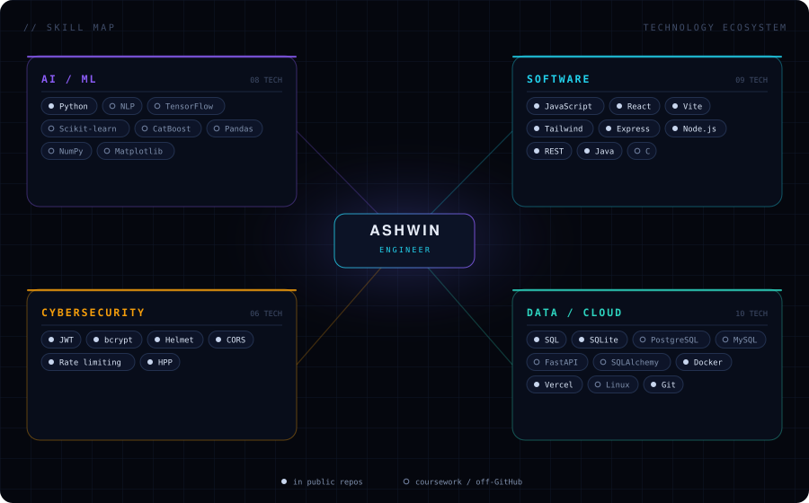

`●` used in public repositories on this account  ·  `○` coursework and projects built off GitHub

---


### Systems on GitHub

| | Project | What it does | Stack |
|---|---|---|---|
| **01** | **[DJI Dronic World](https://github.com/ashwinsathishkumar846-wq/dji-dronic-world)** · [live ↗](https://dji-dronic-world.vercel.app) | Drone service-centre platform: parts catalog with search and filtering, booking flow, delivery tracking, and a JWT-secured admin dashboard with image upload and analytics | React · Vite · Tailwind · Express · SQLite · JWT · Docker |
| **02** | **[LeetCode Solutions](https://github.com/ashwinsathishkumar846-wq/LeetCode-Solution)** | 42 accepted Java solutions organised by topic — 44 problems solved overall, 27 easy and 15 medium | Java · Python · JavaScript |
| **03** | **[Bento Grid](https://github.com/ashwinsathishkumar846-wq/webassignment)** | Frontend Mentor challenge built with CSS Grid placement, responsive across breakpoints | HTML · CSS |

The backend in **01** is hardened rather than demo-grade: Helmet, CORS allow-listing, rate limiting, HPP
protection, request IDs, centralised error handling, readiness checks, and a Dockerfile for deployment.

### Systems built off GitHub

Coursework and hackathon projects — not published as repositories, listed here for completeness.

| | Project | What it does | Stack |
|---|---|---|---|
| **04** | **Workforce Contribution Monitor** | Full-stack system measuring real employee impact, using a custom scoring algorithm designed to reduce bias in productivity tracking | React · FastAPI |
| **05** | **Satellite Water Quality Prediction** | CatBoost model predicting water quality from satellite and geospatial data, with an automated ingestion and preprocessing pipeline | CatBoost · Python |
| **06** | **AI Customer Feedback Intelligence** | Transformer-based sentiment analysis with a churn-prediction and retention pipeline | Transformers · NLP |

---

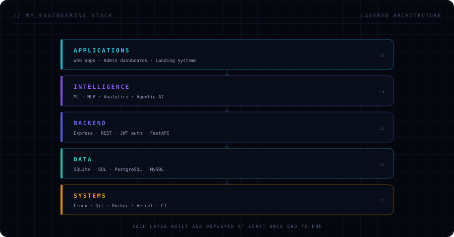

---


---

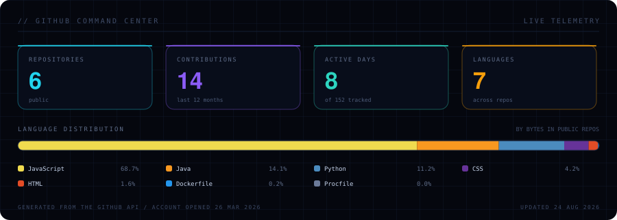


Both panels are generated from the GitHub API by
<a href="scripts/generate_stats.py"><code>scripts/generate_stats.py</code></a> and refreshed daily by
<a href=".github/workflows/refresh-stats.yml">a scheduled workflow</a> — no third-party statistics service,
nothing hard-coded.

---

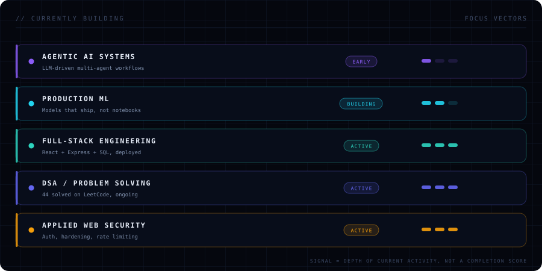

---

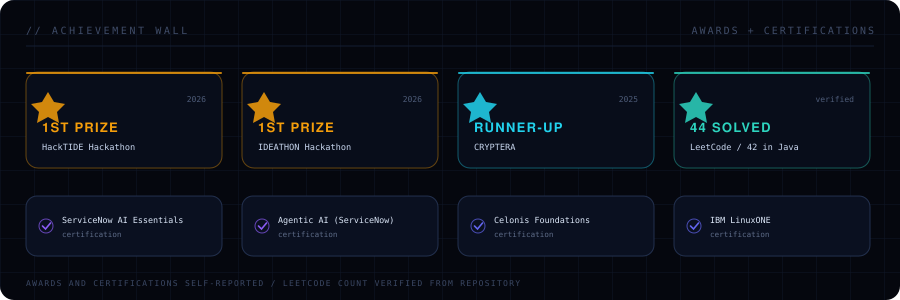

---


<a href="https://github.com/ashwinsathishkumar846-wq">GitHub</a> ·
<a href="https://linkedin.com/in/ashwin-s--">LinkedIn</a> ·
<a href="mailto:ashwinsathishkumar846@gmail.com">Email</a> ·
<a href="https://leetcode.com/u/ashwin1122/">LeetCode</a>

Terminal readout — ASCII profile card

 

<picture>
  <source media="(prefers-color-scheme: dark)" srcset="dark_mode.svg" />
  <source media="(prefers-color-scheme: light)" srcset="light_mode.svg" />
  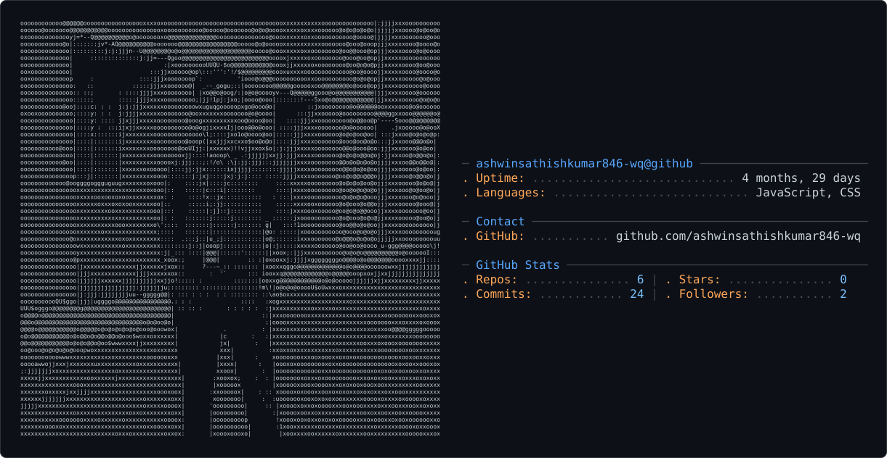
</picture>

