<!--
  ASHWIN // ENGINEERING COMMAND CENTER
  Every panel is an SVG rendered by scripts/ in this repository.
    editorial panels ...... scripts/static_assets.py   (resume + portfolio + repos, curated by hand)
    live panels ........... scripts/generate_profile.py (GitHub + LeetCode APIs, daily workflow)
    activity matrix ....... Platane/snk + scripts/compose_activity.py (every 12 h, `output` branch)
  Each panel ships in two widths; <picture> serves the 440 px build to phones.
-->

<picture>
  <source media="(max-width: 640px)" srcset="assets/m/hero.svg" />
  
</picture>

   

  

<picture>
  <source media="(max-width: 640px)" srcset="assets/m/engineering-core.svg" />
  
</picture>

  

<picture>
  <source media="(max-width: 640px)" srcset="assets/m/technology-network.svg" />
  
</picture>

  

<picture>
  <source media="(max-width: 640px)" srcset="assets/m/project-constellation.svg" />
  
</picture>

  

<picture>
  <source media="(max-width: 640px)" srcset="assets/m/project-01.svg" />
  
</picture>

<a href="https://ashwin-portfolio-tan.vercel.app/#project-workforce">Project 01 case study ↗</a>

  

<picture>
  <source media="(max-width: 640px)" srcset="assets/m/project-02.svg" />
  
</picture>

<a href="https://ashwin-portfolio-tan.vercel.app/#project-water-quality">Project 02 case study ↗</a>

  

<picture>
  <source media="(max-width: 640px)" srcset="assets/m/project-03.svg" />
  
</picture>

<a href="https://ashwin-portfolio-tan.vercel.app/#project-feedback-intelligence">Project 03 case study ↗</a>

  

<picture>
  <source media="(max-width: 640px)" srcset="assets/m/shipped-repos.svg" />
  
</picture>

<a href="https://github.com/ashwinsathishkumar846-wq/dji-dronic-world">dji-dronic-world</a> (<a href="https://dji-dronic-world.vercel.app">live</a>) · <a href="https://github.com/ashwinsathishkumar846-wq/dsa-placement-tracker">dsa-placement-tracker</a> (<a href="https://dsa-placement-tracker-kappa.vercel.app">live</a>) · <a href="https://github.com/ashwinsathishkumar846-wq/ashwin-portfolio">ashwin-portfolio</a> (<a href="https://ashwin-portfolio-tan.vercel.app/">live</a>) · <a href="https://github.com/ashwinsathishkumar846-wq/LeetCode-Solution">LeetCode-Solution</a> · <a href="https://github.com/ashwinsathishkumar846-wq/webassignment">webassignment</a> (<a href="https://ashwinsathishkumar846-wq.github.io/webassignment/">live</a>)

  

<picture>
  <source media="(max-width: 640px)" srcset="assets/m/ai-architecture.svg" />
  
</picture>

  

<picture>
  <source media="(max-width: 640px)" srcset="assets/m/timeline.svg" />
  
</picture>

  

<picture>
  <source media="(max-width: 640px)" srcset="assets/m/github-command-center.svg" />
  
</picture>

  

<picture>
  <source media="(max-width: 640px)" srcset="https://raw.githubusercontent.com/ashwinsathishkumar846-wq/ashwinsathishkumar846-wq/output/activity-matrix-m.svg" />
  
</picture>

  

<picture>
  <source media="(max-width: 640px)" srcset="assets/m/achievement-hall.svg" />
  
</picture>

  

<picture>
  <source media="(max-width: 640px)" srcset="assets/m/research.svg" />
  
</picture>

<a href="https://ashwin-portfolio-tan.vercel.app/#publication">Publication on the portfolio ↗</a>

  

<picture>
  <source media="(max-width: 640px)" srcset="assets/m/certifications.svg" />
  
</picture>

  

<picture>
  <source media="(max-width: 640px)" srcset="assets/m/current-mission.svg" />
  
</picture>

  

<picture>
  <source media="(max-width: 640px)" srcset="assets/m/footer.svg" />
  
</picture>

   

