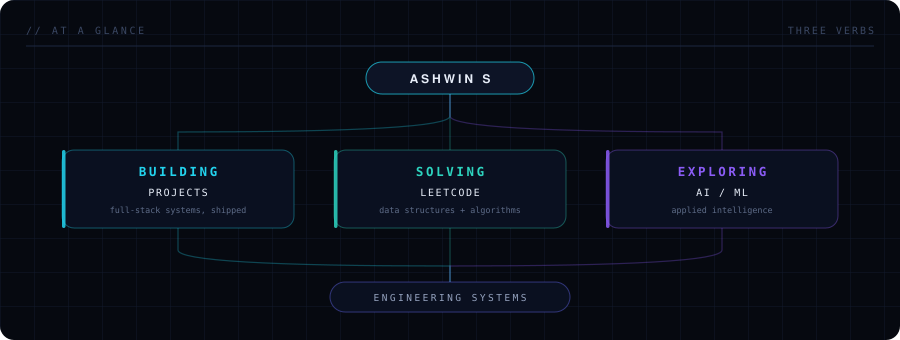
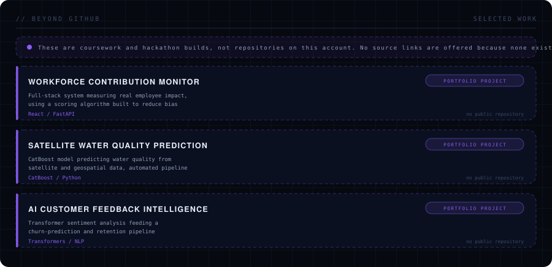
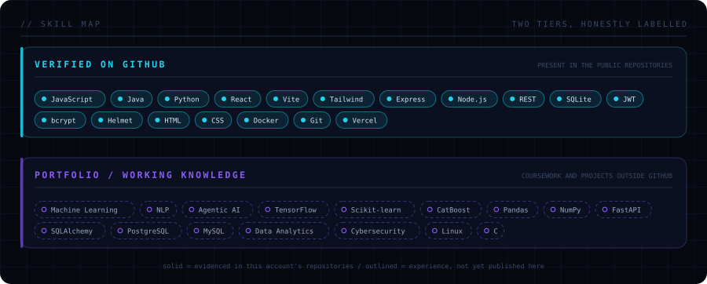
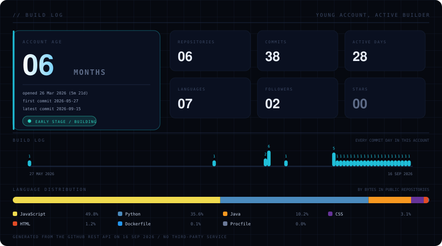
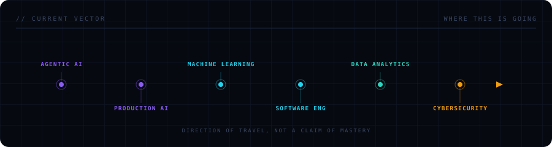
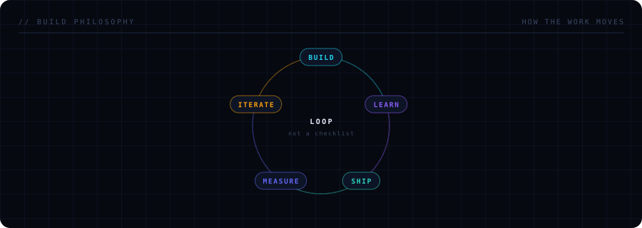

 

---

| | Repository | What it does | Stack |
|---|---|---|---|
| **01** | **[dji-dronic-world](https://github.com/ashwinsathishkumar846-wq/dji-dronic-world)** · [live ↗](https://dji-dronic-world.vercel.app) | Drone service-centre platform — parts catalog with search and filtering, booking flow, delivery tracking, and a JWT-secured admin dashboard with image upload and analytics | React · Vite · Tailwind · Express · SQLite · JWT · Docker |
| **02** | **[LeetCode-Solution](https://github.com/ashwinsathishkumar846-wq/LeetCode-Solution)** | 42 accepted Java solution files organised by topic — 44 problems solved overall | Java · Python · JavaScript |
| **03** | **[webassignment](https://github.com/ashwinsathishkumar846-wq/webassignment)** | Frontend Mentor bento-grid challenge, built with CSS Grid placement | HTML · CSS |

The backend in **01** is hardened rather than demo-grade: Helmet, CORS allow-listing, rate limiting,
HPP protection, request IDs, centralised error handling, readiness checks, and a Dockerfile.

---

---

---

Generated from the GitHub REST API by
<a href="scripts/generate_profile.py"><code>scripts/generate_profile.py</code></a>, refreshed daily by
<a href=".github/workflows/update-profile.yml">a scheduled workflow</a>.
No third-party statistics service, nothing hard-coded.

---

---

---

<a href="https://github.com/ashwinsathishkumar846-wq">GitHub</a> ·
<a href="https://linkedin.com/in/ashwin-s--">LinkedIn</a> ·
<a href="mailto:ashwinsathishkumar846@gmail.com">Email</a> ·
<a href="https://leetcode.com/u/ashwin1122/">LeetCode</a>

&nbsp;terminal readout

 

<picture>
  <source media="(prefers-color-scheme: dark)" srcset="dark_mode.svg" />
  <source media="(prefers-color-scheme: light)" srcset="light_mode.svg" />
  
</picture>

